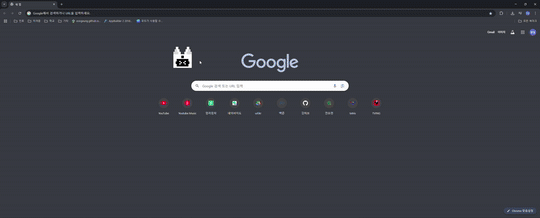

# 🐾 Ondy - 마우스를 따라다니는 귀여운 친구들

> 마우스를 졸졸 따라다니며 화면 위를 떠다니는 온디(Ondy)!  
귀엽고 자유롭게 움직이는 친구들을 만나보세요.

---

## 🎬 예시 화면

---

## 📦 다운로드

- **🪟 Windows 버전:**  
  👉 [https://github.com/eongeung/ondy-window.git](https://github.com/eongeung/ondy-window.git)

- **🍎 macOS 버전:**  
  👉 [https://github.com/eongeung/ondy-mac.git](https://github.com/eongeung/ondy-mac.git)

---

## 🚀 실행 방법
- 저장소에 포함된 실행 파일 실행:
   - Windows: `dist/ondy_app.exe`
   - macOS: `dist - ondy_app - ondy_app` 실행 파일 

---

## ❓ 종료 방법

- **Ondy를 마우스로 한 번 클릭한 뒤, `Q` 키를 누르면 종료됩니다.**

## 📄 라이선스

MIT License  
이미지 및 캐릭터 리소스는 개인 프로젝트 용도로 사용됩니다.
