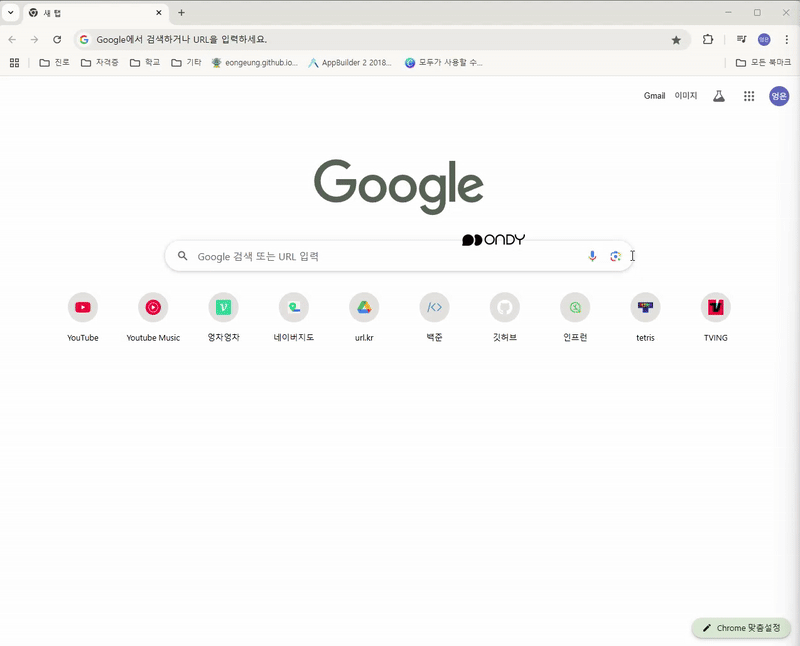

#🐞 Ondy - 자세 교정 시각 피드백 앱

**Ondy**는 사용자의 나쁜 자세를 감지하고,  
컴퓨터 화면 위에 캐릭터를 띄워  
**시각적으로 자세 교정을 유도하는 앱**입니다.

센서 기반의 로봇과 연결되며,  
자세가 나쁘면 Ondy 캐릭터가 늘어나고  
자세가 좋아지면 사라지는 방식으로 동작합니다.

---

## 🛠 주요 기능

- 🪑 **자세 감지** (Arduino + 센서)
- 📡 **시리얼 통신 기반 BAD/GOOD 수신**
- 🖥 **화면 위 시각화 (PyQt5)**
- 🐞 **Ondy 캐릭터 자동 등장 및 이동**
- 👆 **더블 클릭 시 제거 가능**

---

## 💡 예시 화면

| 

---

## ⚙️ 기술 스택

| 분류 | 사용 기술 |
|------|-----------|
| H/W | Arduino UNO, 자세 센서 (MPU6050 등) |
| 분석 | 조건 기반 또는 OpenCV|
| 통신 | pyserial (USB 시리얼 통신) |
| 화면 | Python, PyQt5 |

---

## 🚀 실행 방법

```bash
pip install pyqt5 pyserial
python ondy_app.py
